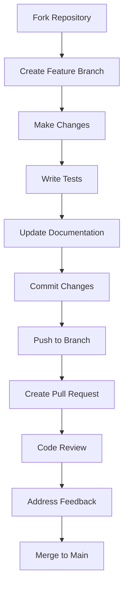

# Contributing to RSC Chain

## Overview

RSC Chain is an open-source project that thrives thanks to contributions from the global community. We appreciate all forms of contribution, from bug reports to new features and documentation improvements.

## How to Contribute

### Types of Contributions

1. **Bug Reports**: Identify and report problems
2. **New Features**: Propose and implement features
3. **Code Improvements**: Optimizations and refactoring
4. **Documentation**: Improve guides and technical documentation
5. **Testing**: Add tests and improve coverage
6. **Translations**: Translate documentation to other languages
7. **Design**: Improve UI/UX and user experience

### Contribution Process



## Development Environment Setup

### Prerequisites

```bash
# Install Rust
curl --proto '=https' --tlsv1.2 -sSf https://sh.rustup.rs | sh
source ~/.cargo/env

# Verify installation
rustc --version
cargo --version

# Install additional tools
cargo install cargo-audit
cargo install cargo-tarpaulin
cargo install cargo-watch
```

### Repository Setup

```bash
# Fork the repository on GitHub
# Then clone your fork
git clone https://github.com/YOUR_USERNAME/rsc-chain.git
cd rsc-chain

# Add the original repository as upstream
git remote add upstream https://github.com/rsc-chain/rsc-chain.git

# Verify remotes
git remote -v
```

### IDE Configuration

#### VS Code (Recommended)

```json
{
    "rust-analyzer.checkOnSave.command": "clippy",
    "rust-analyzer.cargo.buildScripts.enable": true,
    "rust-analyzer.procMacro.enable": true,
    "rust-analyzer.lens.enable": true,
    "rust-analyzer.lens.implementations.enable": true,
    "rust-analyzer.lens.references.adt.enable": true,
    "rust-analyzer.lens.references.trait.enable": true,
    "rust-analyzer.lens.references.enumVariant.enable": true,
    "rust-analyzer.lens.references.method.enable": true,
    "rust-analyzer.assist.emitMustUse": true,
    "rust-analyzer.assist.emitMustUseOrPanic": true,
    "rust-analyzer.assist.emitMustUseOrDrop": true
}
```

#### Essential Extensions

- rust-analyzer
- CodeLLDB
- GitLens
- Git History
- Docker
- REST Client
- Markdown All in One

## Code Standards

### Naming Conventions

```rust
// Structures and Enums - PascalCase
pub struct BlockchainNode;
pub enum ConsensusType {
    ProofOfWork,
    ProofOfStake,
    Hybrid,
}

// Functions and Variables - snake_case
pub fn create_transaction() -> Result<Transaction, Error> {
    let transaction_hash = calculate_hash();
    Ok(transaction_hash)
}

// Constants - SCREAMING_SNAKE_CASE
pub const MAX_BLOCK_SIZE: usize = 1024;
pub const DEFAULT_GAS_LIMIT: u64 = 21_000;

// Types - PascalCase
pub type BlockHash = [u8; 32];
pub type Address = [u8; 20];
```

### Code Formatting

```bash
# Format code automatically
cargo fmt

# Verify formatting
cargo fmt -- --check

# Linting with Clippy
cargo clippy --all-targets --all-features -- -D warnings

# Verify security
cargo audit
```

### Documentation

```rust
/// Represents a block in the RSC Chain blockchain
/// 
/// # Examples
/// 
/// ```
/// use rsc_chain::blockchain::Block;
/// 
/// let block = Block::new(
///     BlockHeader::new(1, Hash::zero(), Hash::zero()),
///     vec![]
/// );
/// ```
pub struct Block {
    /// Block header containing metadata
    pub header: BlockHeader,
    /// Transactions included in the block
    pub transactions: Vec<Transaction>,
}

impl Block {
    /// Creates a new block with the specified header and transactions
    /// 
    /// # Arguments
    /// * `header` - Block header
    /// * `transactions` - Vector of transactions
    /// 
    /// # Returns
    /// A new Block instance
    /// 
    /// # Examples
    /// 
    /// ```
    /// # use rsc_chain::blockchain::{Block, BlockHeader, Hash};
    /// let header = BlockHeader::new(1, Hash::zero(), Hash::zero());
    /// let block = Block::new(header, vec![]);
    /// ```
    pub fn new(header: BlockHeader, transactions: Vec<Transaction>) -> Self {
        Self {
            header,
            transactions,
        }
    }
    
    /// Calculates the hash of the block
    /// 
    /// # Returns
    /// SHA-256 hash of the block
    pub fn hash(&self) -> Hash {
        // Hash implementation
        Hash::zero() // Placeholder
    }
}
```

### Error Handling

```rust
use thiserror::Error;

#[derive(Error, Debug)]
pub enum BlockchainError {
    #[error("Invalid block: {0}")]
    InvalidBlock(String),
    
    #[error("Invalid transaction: {0}")]
    InvalidTransaction(String),
    
    #[error("Consensus error: {0}")]
    ConsensusError(String),
    
    #[error("Network error: {0}")]
    NetworkError(#[from] std::io::Error),
    
    #[error("Database error: {0}")]
    DatabaseError(#[from] rocksdb::Error),
}

// Usage in functions
pub fn validate_block(block: &Block) -> Result<(), BlockchainError> {
    if block.header.height == 0 {
        return Err(BlockchainError::InvalidBlock(
            "Block height cannot be zero".to_string()
        ));
    }
    
    if block.transactions.is_empty() {
        return Err(BlockchainError::InvalidBlock(
            "Block must contain at least one transaction".to_string()
        ));
    }
    
    Ok(())
}
```

## Testing

### Unit Testing

```rust
#[cfg(test)]
mod tests {
    use super::*;
    use rstest::*;
    
    #[test]
    fn test_block_creation() {
        let header = BlockHeader::new(1, Hash::zero(), Hash::zero());
        let transactions = vec![];
        let block = Block::new(header, transactions);
        
        assert_eq!(block.header.height, 1);
        assert_eq!(block.transactions.len(), 0);
    }
    
    #[test]
    fn test_block_validation() {
        let header = BlockHeader::new(0, Hash::zero(), Hash::zero());
        let transactions = vec![];
        let block = Block::new(header, transactions);
        
        let result = validate_block(&block);
        assert!(result.is_err());
        
        if let Err(BlockchainError::InvalidBlock(msg)) = result {
            assert!(msg.contains("Block height cannot be zero"));
        }
    }
    
    #[rstest]
    #[case(1, true)]
    #[case(0, false)]
    #[case(100, true)]
    fn test_block_height_validation(#[case] height: u64, #[case] expected: bool) {
        let header = BlockHeader::new(height, Hash::zero(), Hash::zero());
        let transactions = vec![Transaction::new()];
        let block = Block::new(header, transactions);
        
        let result = validate_block(&block);
        assert_eq!(result.is_ok(), expected);
    }
}
```

### Integration Testing

```rust
// tests/integration_test.rs
use rsc_chain::blockchain::{Blockchain, Block, Transaction};
use rsc_chain::consensus::ConsensusEngine;

#[tokio::test]
async fn test_blockchain_consensus() {
    let mut blockchain = Blockchain::new();
    let consensus = ConsensusEngine::new();
    
    // Create genesis block
    let genesis_block = Block::genesis();
    blockchain.add_block(genesis_block).unwrap();
    
    // Create transaction
    let transaction = Transaction::new(
        Address::from([0x01; 20]),
        Address::from([0x02; 20]),
        U256::from(1000),
        vec![]
    );
    
    // Process transaction
    let result = consensus.process_transaction(&mut blockchain, transaction).await;
    assert!(result.is_ok());
    
    // Verify new block was created
    assert_eq!(blockchain.height(), 2);
}
```

### Performance Testing

```rust
use criterion::{criterion_group, criterion_main, Criterion, BenchmarkId};

fn benchmark_block_validation(c: &mut Criterion) {
    let mut group = c.benchmark_group("block_validation");
    
    for size in [10, 100, 1000].iter() {
        group.bench_with_input(
            BenchmarkId::new("transactions", size),
            size,
            |b, &size| {
                b.iter(|| {
                    let transactions: Vec<Transaction> = (0..size)
                        .map(|_| Transaction::new())
                        .collect();
                    
                    let block = Block::new(
                        BlockHeader::new(1, Hash::zero(), Hash::zero()),
                        transactions
                    );
                    
                    validate_block(&block).unwrap();
                });
            },
        );
    }
    
    group.finish();
}

criterion_group!(benches, benchmark_block_validation);
criterion_main!(benches);
```

### Security Testing

```rust
#[cfg(test)]
mod security_tests {
    use super::*;
    use proptest::prelude::*;
    
    proptest! {
        #[test]
        fn test_transaction_overflow_doesnt_panic(
            from in prop::array::uniform20(any::<u8>()),
            to in prop::array::uniform20(any::<u8>()),
            value in any::<u64>()
        ) {
            let transaction = Transaction::new(
                Address::from(from),
                Address::from(to),
                U256::from(value),
                vec![]
            );
            
            // Should not panic
            let _ = transaction.validate();
        }
    }
    
    #[test]
    fn test_sql_injection_prevention() {
        let malicious_input = "'; DROP TABLE blocks; --";
        
        // Verify that malicious input does not cause issues
        let result = sanitize_input(malicious_input);
        assert_ne!(result, malicious_input);
    }
}
```

## Pull Request Process

### Create a Feature Branch

```bash
# Ensure you are on main and up-to-date
git checkout main
git pull upstream main

# Create new branch
git checkout -b feature/new-feature

# Or for bug fixes
git checkout -b fix/bug-name
```

### Make Changes

```bash
# Make changes to the code
# Write tests
# Update documentation

# Verify everything compiles
cargo check

# Run tests
cargo test

# Verify formatting
cargo fmt -- --check

# Verify linting
cargo clippy --all-targets --all-features -- -D warnings
```

### Commits

```bash
# Atomic and descriptive commits
git add .
git commit -m "feat: add transaction validation

- Implement digital signature validation
- Add balance verification
- Include unit tests
- Update documentation

Closes #123"

# Recommended commit types:
# feat: new functionality
# fix: bug fix
# docs: documentation changes
# style: formatting changes
# refactor: code refactoring
# test: add or modify tests
# chore: maintenance tasks
```

### Push and Pull Request

```bash
# Push to your fork
git push origin feature/new-feature

# Create Pull Request on GitHub
# Use the PR template
```

### Pull Request Template

```markdown
## Description
Brief description of the changes made.

## Type of Change
- [ ] Bug fix (change that fixes a problem)
- [ ] New functionality (change that adds functionality)
- [ ] Breaking change (change that breaks existing functionality)
- [ ] Documentation (change in documentation)

## Testing
- [ ] Unit tests added/updated
- [ ] Integration tests added/updated
- [ ] Performance tests executed
- [ ] All tests pass locally

## Checklist
- [ ] Code follows project standards
- [ ] Documentation updated
- [ ] Commits follow conventions
- [ ] No Clippy warnings
- [ ] Cargo audit passes without errors

## Screenshots (if applicable)
Add screenshots for UI changes.

## Additional Information
Any additional relevant information.
```

## Code Review

### Review Process

1. **Automated Review**: CI/CD verifies tests and quality
2. **Manual Review**: At least one maintainer must approve
3. **Feedback**: Constructive comments in the PR
4. **Iteration**: Make changes based on feedback
5. **Approval**: Merge when ready

### Approval Criteria

- ✅ Code compiles without errors
- ✅ All tests pass
- ✅ Adequate test coverage
- ✅ Documentation updated
- ✅ No Clippy warnings
- ✅ Code formatted correctly
- ✅ Error handling appropriate
- ✅ Performance acceptable
- ✅ Security verified

### Review Comments

```markdown
# Examples of constructive comments

## Positive
👍 Excellent implementation! The code is clear and well-documented.

## Suggestions
💡 Consider using `Option<T>` instead of `Result<T, ()>` for this case.

## Problems
🐛 There is a potential race condition in this function.

## Questions
❓ Why did you choose this approach over...?
```

## Bug Reports

### Bug Report Template

```markdown
## Description of the Bug
Clear and concise description of the problem.

## Steps to Reproduce
1. Go to '...'
2. Click on '...'
3. Scroll to '...'
4. See error

## Expected Behavior
What should happen.

## Actual Behavior
What actually happens.

## Screenshots
If applicable, add screenshots.

## System Information
- OS: [e.g. Ubuntu 20.04]
- Rust Version: [e.g. 1.70.0]
- RSC Chain Version: [e.g. 0.1.0]

## Logs
```
[Paste logs here]
```

## Additional Context
Any additional relevant information.
```

### Bug Triage

```rust
// Bug Priorities
pub enum BugPriority {
    Critical,    // Blocks main functionality
    High,        // Important functionality affected
    Medium,      // Secondary functionality affected
    Low,         // Minor improvement
}

// Bug States
pub enum BugStatus {
    Open,        // New bug reported
    InProgress,  // In development
    Review,      // Under review
    Resolved,    // Solved
    Closed,      // Closed
    Won'tFix,    // Won't be fixed
}
```

## Feature Proposals

### Feature Request Template

```markdown
## Summary
Clear description of the desired functionality.

## Motivation
Why this functionality is necessary.

## Proposal
Detailed description of the proposed implementation.

## Alternatives Considered
Other options considered.

## Impact
- Users affected
- API changes
- Performance
- Security

## Timeline
Estimated time for implementation.

## Required Resources
- Developers
- Infrastructure
- Testing
```

### Approval Process

1. **Discussion**: Debate on GitHub Issues
2. **RFC**: Request for Comments if necessary
3. **Design**: Detailed technical documentation
4. **Implementation**: Iterative development
5. **Testing**: Comprehensive tests
6. **Review**: Rigorous code review
7. **Merge**: Integration into main

## Community

### Communication Channels

- **GitHub Issues**: Bugs and feature requests
- **GitHub Discussions**: General questions
- **Discord**: Real-time chat
- **Telegram**: Notifications and announcements
- **Email**: Private contact

### Events

- **Hackathons**: Development events
- **Meetups**: Local meetups
- **Conferences**: Technical presentations
- **Workshops**: Learning sessions

### Recognition

```rust
// Notable Contributors
pub struct Contributor {
    pub name: String,
    pub contributions: Vec<Contribution>,
    pub badges: Vec<Badge>,
}

pub enum Badge {
    FirstPullRequest,
    BugHunter,
    DocumentationHero,
    PerformanceGuru,
    SecurityExpert,
    CommunityChampion,
}
```

## Learning Resources

### Documentation

- [Rust Book](https://doc.rust-lang.org/book/)
- [Rust Reference](https://doc.rust-lang.org/reference/)
- [Rust by Example](https://doc.rust-lang.org/rust-by-example/)
- [RSC Chain Architecture](https://docs.rsc-chain.com/architecture)

### Tools

- [Rust Playground](https://play.rust-lang.org/)
- [Rust Analyzer](https://rust-analyzer.github.io/)
- [Clippy](https://github.com/rust-lang/rust-clippy)
- [Criterion](https://github.com/bheisler/criterion.rs)

### Rust Community

- [Rust Forum](https://users.rust-lang.org/)
- [Reddit r/rust](https://www.reddit.com/r/rust/)
- [Stack Overflow](https://stackoverflow.com/questions/tagged/rust)

## Code of Conduct

### Principles

- **Respect**: Treat everyone with respect
- **Inclusion**: Encourage diverse participation
- **Collaboration**: Work together constructively
- **Excellence**: Strive for the best possible quality

### Reporting

To report violations of the code of conduct:
- Email: conduct@rsc-chain.com
- Discord: DM moderators
- GitHub: Private issue

### Consequences

- Warning
- Temporary suspension
- Permanent expulsion

---

*Thank you for contributing to RSC Chain! Your work makes the blockchain better for everyone.*
