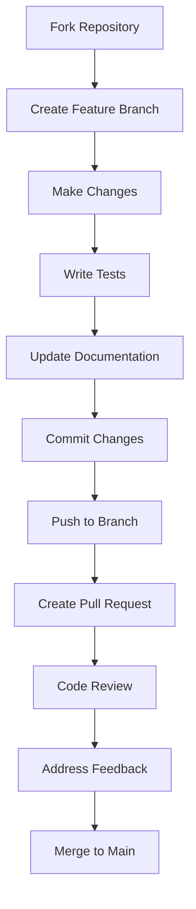

# Contribuir a RSC Chain

## Visión General

RSC Chain es un proyecto de código abierto que prospera gracias a las contribuciones de la comunidad global. Agradecemos todas las formas de contribución, desde reportes de bugs hasta nuevas funcionalidades y mejoras en la documentación.

## Cómo Contribuir

### Tipos de Contribuciones

1. **Reportes de Bugs**: Identificar y reportar problemas
2. **Nuevas Funcionalidades**: Proponer e implementar características
3. **Mejoras de Código**: Optimizaciones y refactoring
4. **Documentación**: Mejorar guías y documentación técnica
5. **Testing**: Añadir tests y mejorar cobertura
6. **Traducciones**: Traducir documentación a otros idiomas
7. **Diseño**: Mejorar UI/UX y experiencia de usuario

### Proceso de Contribución



## Configuración del Entorno de Desarrollo

### Requisitos Previos

```bash
# Instalar Rust
curl --proto '=https' --tlsv1.2 -sSf https://sh.rustup.rs | sh
source ~/.cargo/env

# Verificar instalación
rustc --version
cargo --version

# Instalar herramientas adicionales
cargo install cargo-audit
cargo install cargo-tarpaulin
cargo install cargo-watch
```

### Configuración del Repositorio

```bash
# Fork del repositorio en GitHub
# Luego clonar tu fork
git clone https://github.com/TU_USUARIO/rsc-chain.git
cd rsc-chain

# Añadir el repositorio original como upstream
git remote add upstream https://github.com/rsc-chain/rsc-chain.git

# Verificar remotes
git remote -v
```

### Configuración del IDE

#### VS Code (Recomendado)

```json
{
    "rust-analyzer.checkOnSave.command": "clippy",
    "rust-analyzer.cargo.buildScripts.enable": true,
    "rust-analyzer.procMacro.enable": true,
    "rust-analyzer.lens.enable": true,
    "rust-analyzer.lens.implementations.enable": true,
    "rust-analyzer.lens.references.adt.enable": true,
    "rust-analyzer.lens.references.trait.enable": true,
    "rust-analyzer.lens.references.enumVariant.enable": true,
    "rust-analyzer.lens.references.method.enable": true,
    "rust-analyzer.assist.emitMustUse": true,
    "rust-analyzer.assist.emitMustUseOrPanic": true,
    "rust-analyzer.assist.emitMustUseOrDrop": true
}
```

#### Extensiones Esenciales

- rust-analyzer
- CodeLLDB
- GitLens
- Git History
- Docker
- REST Client
- Markdown All in One

## Estándares de Código

### Convenciones de Nomenclatura

```rust
// Estructuras y Enums - PascalCase
pub struct BlockchainNode;
pub enum ConsensusType {
    ProofOfWork,
    ProofOfStake,
    Hybrid,
}

// Funciones y Variables - snake_case
pub fn create_transaction() -> Result<Transaction, Error> {
    let transaction_hash = calculate_hash();
    Ok(transaction_hash)
}

// Constantes - SCREAMING_SNAKE_CASE
pub const MAX_BLOCK_SIZE: usize = 1024;
pub const DEFAULT_GAS_LIMIT: u64 = 21_000;

// Tipos - PascalCase
pub type BlockHash = [u8; 32];
pub type Address = [u8; 20];
```

### Formato de Código

```bash
# Formatear código automáticamente
cargo fmt

# Verificar formato
cargo fmt -- --check

# Linting con Clippy
cargo clippy --all-targets --all-features -- -D warnings

# Verificar seguridad
cargo audit
```

### Documentación

```rust
/// Representa un bloque en la blockchain RSC Chain
/// 
/// # Ejemplos
/// 
/// ```
/// use rsc_chain::blockchain::Block;
/// 
/// let block = Block::new(
///     BlockHeader::new(1, Hash::zero(), Hash::zero()),
///     vec![]
/// );
/// ```
pub struct Block {
    /// Encabezado del bloque que contiene metadatos
    pub header: BlockHeader,
    /// Lista de transacciones incluidas en el bloque
    pub transactions: Vec<Transaction>,
}

impl Block {
    /// Crea un nuevo bloque con el encabezado y transacciones especificados
    /// 
    /// # Arguments
    /// * `header` - Encabezado del bloque
    /// * `transactions` - Vector de transacciones
    /// 
    /// # Returns
    /// Una nueva instancia de Block
    /// 
    /// # Ejemplos
    /// 
    /// ```
    /// # use rsc_chain::blockchain::{Block, BlockHeader, Hash};
    /// let header = BlockHeader::new(1, Hash::zero(), Hash::zero());
    /// let block = Block::new(header, vec![]);
    /// ```
    pub fn new(header: BlockHeader, transactions: Vec<Transaction>) -> Self {
        Self {
            header,
            transactions,
        }
    }
    
    /// Calcula el hash del bloque
    /// 
    /// # Returns
    /// Hash SHA-256 del bloque
    pub fn hash(&self) -> Hash {
        // Implementación del hash
        Hash::zero() // Placeholder
    }
}
```

### Manejo de Errores

```rust
use thiserror::Error;

#[derive(Error, Debug)]
pub enum BlockchainError {
    #[error("Bloque inválido: {0}")]
    InvalidBlock(String),
    
    #[error("Transacción inválida: {0}")]
    InvalidTransaction(String),
    
    #[error("Error de consenso: {0}")]
    ConsensusError(String),
    
    #[error("Error de red: {0}")]
    NetworkError(#[from] std::io::Error),
    
    #[error("Error de base de datos: {0}")]
    DatabaseError(#[from] rocksdb::Error),
}

// Uso en funciones
pub fn validate_block(block: &Block) -> Result<(), BlockchainError> {
    if block.header.height == 0 {
        return Err(BlockchainError::InvalidBlock(
            "Altura del bloque no puede ser cero".to_string()
        ));
    }
    
    if block.transactions.is_empty() {
        return Err(BlockchainError::InvalidBlock(
            "Bloque debe contener al menos una transacción".to_string()
        ));
    }
    
    Ok(())
}
```

## Testing

### Testing Unitario

```rust
#[cfg(test)]
mod tests {
    use super::*;
    use rstest::*;
    
    #[test]
    fn test_block_creation() {
        let header = BlockHeader::new(1, Hash::zero(), Hash::zero());
        let transactions = vec![];
        let block = Block::new(header, transactions);
        
        assert_eq!(block.header.height, 1);
        assert_eq!(block.transactions.len(), 0);
    }
    
    #[test]
    fn test_block_validation() {
        let header = BlockHeader::new(0, Hash::zero(), Hash::zero());
        let transactions = vec![];
        let block = Block::new(header, transactions);
        
        let result = validate_block(&block);
        assert!(result.is_err());
        
        if let Err(BlockchainError::InvalidBlock(msg)) = result {
            assert!(msg.contains("Altura del bloque no puede ser cero"));
        }
    }
    
    #[rstest]
    #[case(1, true)]
    #[case(0, false)]
    #[case(100, true)]
    fn test_block_height_validation(#[case] height: u64, #[case] expected: bool) {
        let header = BlockHeader::new(height, Hash::zero(), Hash::zero());
        let transactions = vec![Transaction::new()];
        let block = Block::new(header, transactions);
        
        let result = validate_block(&block);
        assert_eq!(result.is_ok(), expected);
    }
}
```

### Testing de Integración

```rust
// tests/integration_test.rs
use rsc_chain::blockchain::{Blockchain, Block, Transaction};
use rsc_chain::consensus::ConsensusEngine;

#[tokio::test]
async fn test_blockchain_consensus() {
    let mut blockchain = Blockchain::new();
    let consensus = ConsensusEngine::new();
    
    // Crear bloque genesis
    let genesis_block = Block::genesis();
    blockchain.add_block(genesis_block).unwrap();
    
    // Crear transacción
    let transaction = Transaction::new(
        Address::from([0x01; 20]),
        Address::from([0x02; 20]),
        U256::from(1000),
        vec![]
    );
    
    // Procesar transacción
    let result = consensus.process_transaction(&mut blockchain, transaction).await;
    assert!(result.is_ok());
    
    // Verificar que se creó un nuevo bloque
    assert_eq!(blockchain.height(), 2);
}
```

### Testing de Performance

```rust
use criterion::{criterion_group, criterion_main, Criterion, BenchmarkId};

fn benchmark_block_validation(c: &mut Criterion) {
    let mut group = c.benchmark_group("block_validation");
    
    for size in [10, 100, 1000].iter() {
        group.bench_with_input(
            BenchmarkId::new("transactions", size),
            size,
            |b, &size| {
                b.iter(|| {
                    let transactions: Vec<Transaction> = (0..size)
                        .map(|_| Transaction::new())
                        .collect();
                    
                    let block = Block::new(
                        BlockHeader::new(1, Hash::zero(), Hash::zero()),
                        transactions
                    );
                    
                    validate_block(&block).unwrap();
                });
            },
        );
    }
    
    group.finish();
}

criterion_group!(benches, benchmark_block_validation);
criterion_main!(benches);
```

### Testing de Seguridad

```rust
#[cfg(test)]
mod security_tests {
    use super::*;
    use proptest::prelude::*;
    
    proptest! {
        #[test]
        fn test_transaction_overflow_doesnt_panic(
            from in prop::array::uniform20(any::<u8>()),
            to in prop::array::uniform20(any::<u8>()),
            value in any::<u64>()
        ) {
            let transaction = Transaction::new(
                Address::from(from),
                Address::from(to),
                U256::from(value),
                vec![]
            );
            
            // No debe hacer panic
            let _ = transaction.validate();
        }
    }
    
    #[test]
    fn test_sql_injection_prevention() {
        let malicious_input = "'; DROP TABLE blocks; --";
        
        // Verificar que el input malicioso no causa problemas
        let result = sanitize_input(malicious_input);
        assert_ne!(result, malicious_input);
    }
}
```

## Proceso de Pull Request

### Crear una Rama de Feature

```bash
# Asegurarse de estar en main y actualizado
git checkout main
git pull upstream main

# Crear nueva rama
git checkout -b feature/nueva-funcionalidad

# O para bug fixes
git checkout -b fix/nombre-del-bug
```

### Hacer Cambios

```bash
# Hacer cambios en el código
# Escribir tests
# Actualizar documentación

# Verificar que todo compila
cargo check

# Ejecutar tests
cargo test

# Verificar formato
cargo fmt -- --check

# Verificar linting
cargo clippy --all-targets --all-features -- -D warnings
```

### Commits

```bash
# Commits atómicos y descriptivos
git add .
git commit -m "feat: añadir validación de transacciones

- Implementar validación de firma digital
- Añadir verificación de balance
- Incluir tests unitarios
- Actualizar documentación

Closes #123"

# Tipos de commits recomendados:
# feat: nueva funcionalidad
# fix: corrección de bug
# docs: cambios en documentación
# style: cambios de formato
# refactor: refactoring de código
# test: añadir o modificar tests
# chore: tareas de mantenimiento
```

### Push y Pull Request

```bash
# Push a tu fork
git push origin feature/nueva-funcionalidad

# Crear Pull Request en GitHub
# Usar la plantilla de PR
```

### Plantilla de Pull Request

```markdown
## Descripción
Breve descripción de los cambios realizados.

## Tipo de Cambio
- [ ] Bug fix (cambio que corrige un problema)
- [ ] Nueva funcionalidad (cambio que añade funcionalidad)
- [ ] Breaking change (cambio que rompe funcionalidad existente)
- [ ] Documentación (cambio en documentación)

## Testing
- [ ] Tests unitarios añadidos/actualizados
- [ ] Tests de integración añadidos/actualizados
- [ ] Tests de performance ejecutados
- [ ] Todos los tests pasan localmente

## Checklist
- [ ] Código sigue los estándares del proyecto
- [ ] Documentación actualizada
- [ ] Commits siguen las convenciones
- [ ] No hay warnings de Clippy
- [ ] Cargo audit pasa sin errores

## Screenshots (si aplica)
Añadir screenshots para cambios de UI.

## Información Adicional
Cualquier información adicional relevante.
```

## Code Review

### Proceso de Review

1. **Revisión Automática**: CI/CD verifica tests y calidad
2. **Revisión Manual**: Al menos un maintainer debe aprobar
3. **Feedback**: Comentarios constructivos en el PR
4. **Iteración**: Hacer cambios basados en feedback
5. **Aprobación**: Merge cuando esté listo

### Criterios de Aprobación

- ✅ Código compila sin errores
- ✅ Todos los tests pasan
- ✅ Cobertura de tests adecuada
- ✅ Documentación actualizada
- ✅ Sin warnings de Clippy
- ✅ Código formateado correctamente
- ✅ Manejo de errores apropiado
- ✅ Performance aceptable
- ✅ Seguridad verificada

### Comentarios de Review

```markdown
# Ejemplos de comentarios constructivos

## Positivo
👍 Excelente implementación! El código es claro y bien documentado.

## Sugerencias
💡 Considera usar `Option<T>` en lugar de `Result<T, ()>` para este caso.

## Problemas
🐛 Hay un potencial race condition en esta función.

## Preguntas
❓ ¿Por qué elegiste este enfoque en lugar de...?
```

## Reportes de Bugs

### Plantilla de Bug Report

```markdown
## Descripción del Bug
Descripción clara y concisa del problema.

## Pasos para Reproducir
1. Ir a '...'
2. Hacer clic en '...'
3. Scroll hasta '...'
4. Ver error

## Comportamiento Esperado
Lo que debería pasar.

## Comportamiento Actual
Lo que realmente pasa.

## Screenshots
Si aplica, añadir screenshots.

## Información del Sistema
- OS: [e.g. Ubuntu 20.04]
- Rust Version: [e.g. 1.70.0]
- RSC Chain Version: [e.g. 0.1.0]

## Logs
```
[Paste logs here]
```

## Contexto Adicional
Cualquier información adicional relevante.
```

### Bug Triage

```rust
// Prioridades de bugs
pub enum BugPriority {
    Critical,    // Bloquea funcionalidad principal
    High,        // Funcionalidad importante afectada
    Medium,      // Funcionalidad secundaria afectada
    Low,         // Mejora menor
}

// Estados de bugs
pub enum BugStatus {
    Open,        // Nuevo bug reportado
    InProgress,  // En desarrollo
    Review,      // En revisión
    Resolved,    // Solucionado
    Closed,      // Cerrado
    Won'tFix,    // No se solucionará
}
```

## Propuestas de Funcionalidades

### Plantilla de Feature Request

```markdown
## Resumen
Descripción clara de la funcionalidad deseada.

## Motivación
Por qué esta funcionalidad es necesaria.

## Propuesta
Descripción detallada de la implementación propuesta.

## Alternativas Consideradas
Otras opciones que se consideraron.

## Impacto
- Usuarios afectados
- Cambios en API
- Performance
- Seguridad

## Timeline
Estimación de tiempo para implementación.

## Recursos Necesarios
- Desarrolladores
- Infraestructura
- Testing
```

### Proceso de Aprobación

1. **Discusión**: Debate en GitHub Issues
2. **RFC**: Request for Comments si es necesario
3. **Diseño**: Documentación técnica detallada
4. **Implementación**: Desarrollo iterativo
5. **Testing**: Tests exhaustivos
6. **Review**: Code review riguroso
7. **Merge**: Integración a main

## Comunidad

### Canales de Comunicación

- **GitHub Issues**: Bugs y feature requests
- **GitHub Discussions**: Preguntas generales
- **Discord**: Chat en tiempo real
- **Telegram**: Notificaciones y anuncios
- **Email**: Contacto privado

### Eventos

- **Hackathons**: Eventos de desarrollo
- **Meetups**: Encuentros locales
- **Conferencias**: Presentaciones técnicas
- **Workshops**: Sesiones de aprendizaje

### Reconocimiento

```rust
// Contribuidores destacados
pub struct Contributor {
    pub name: String,
    pub contributions: Vec<Contribution>,
    pub badges: Vec<Badge>,
}

pub enum Badge {
    FirstPullRequest,
    BugHunter,
    DocumentationHero,
    PerformanceGuru,
    SecurityExpert,
    CommunityChampion,
}
```

## Recursos de Aprendizaje

### Documentación

- [Rust Book](https://doc.rust-lang.org/book/)
- [Rust Reference](https://doc.rust-lang.org/reference/)
- [Rust by Example](https://doc.rust-lang.org/rust-by-example/)
- [RSC Chain Architecture](https://docs.rsc-chain.com/architecture)

### Herramientas

- [Rust Playground](https://play.rust-lang.org/)
- [Rust Analyzer](https://rust-analyzer.github.io/)
- [Clippy](https://github.com/rust-lang/rust-clippy)
- [Criterion](https://github.com/bheisler/criterion.rs)

### Comunidad Rust

- [Rust Forum](https://users.rust-lang.org/)
- [Reddit r/rust](https://www.reddit.com/r/rust/)
- [Stack Overflow](https://stackoverflow.com/questions/tagged/rust)

## Código de Conducta

### Principios

- **Respeto**: Tratar a todos con respeto
- **Inclusión**: Fomentar participación diversa
- **Colaboración**: Trabajar juntos constructivamente
- **Excelencia**: Buscar la mejor calidad posible

### Reportes

Para reportar violaciones del código de conducta:
- Email: conduct@rsc-chain.com
- Discord: DM a moderadores
- GitHub: Issue privado

### Consecuencias

- Advertencia
- Suspensión temporal
- Expulsión permanente

---

*Gracias por contribuir a RSC Chain! Tu trabajo hace que la blockchain sea mejor para todos.*
